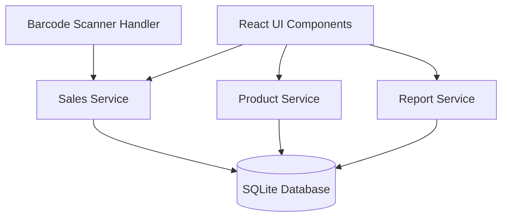

# تصميم نظام الكاشير (POS System Design)

## نظرة عامة

نظام كاشير محلي خفيف مصمم للعمل على أجهزة ضعيفة المواصفات. النظام يستخدم قاعدة بيانات محلية (SQLite) ويدعم ماسح الباركود، تسعير مزدوج (جملة/قطاعي)، وإدارة فئات المنتجات.

### الأهداف التصميمية

1. **الأداء**: استجابة سريعة على أجهزة ضعيفة (2GB RAM)
2. **البساطة**: واجهة مستخدم بسيطة وسهلة
3. **الموثوقية**: عمل مستقر بدون اتصال إنترنت
4. **المرونة**: دعم تسعير مزدوج وفئات متعددة

### اختيار التقنيات

**Framework المقترح: Electron + React**

الأسباب:
- Electron يسمح ببناء تطبيق desktop يعمل على Windows/Linux/Mac
- React خفيف وسريع للواجهات التفاعلية
- SQLite مدمج بسهولة مع Electron
- دعم ممتاز للماسحات الضوئية (USB HID)
- استهلاك معقول للموارد مع التحسينات المناسبة

**بدائل محتملة:**
- **Tauri + React**: أخف من Electron لكن أقل نضجاً
- **Flutter Desktop**: أداء ممتاز لكن أقل دعماً للأجهزة الطرفية
- **Web App محلي (Node.js + Express)**: يحتاج متصفح دائماً

## البنية المعمارية

### Architecture Pattern: Layered Architecture

```
┌─────────────────────────────────────┐
│     Presentation Layer (React)      │
│  - POS Screen                       │
│  - Products Management              │
│  - Reports                          │
└─────────────────────────────────────┘
              ↓
┌─────────────────────────────────────┐
│   Business Logic Layer (Services)   │
│  - SalesService                     │
│  - ProductService                   │
│  - ReportService                    │
└─────────────────────────────────────┘
              ↓
┌─────────────────────────────────────┐
│   Data Access Layer (Repositories)  │
│  - ProductRepository                │
│  - InvoiceRepository                │
│  - CategoryRepository               │
└─────────────────────────────────────┘
              ↓
┌─────────────────────────────────────┐
│      Database Layer (SQLite)        │
└─────────────────────────────────────┘
```

### Component Diagram



## المكونات والواجهات

### 1. Presentation Layer (React Components)

#### POSScreen Component
```typescript
interface POSScreenProps {
  onInvoiceComplete: (invoice: Invoice) => void;
}

interface POSScreenState {
  currentInvoice: Invoice;
  pricingType: 'wholesale' | 'retail';
  scannedBarcode: string;
}
```

#### ProductManagement Component
```typescript
interface ProductManagementProps {
  onProductSaved: (product: Product) => void;
}
```

#### ReportsScreen Component
```typescript
interface ReportsScreenProps {
  dateRange: DateRange;
  reportType: 'daily' | 'period' | 'topProducts' | 'inventory';
}
```

### 2. Business Logic Layer

#### SalesService
```typescript
class SalesService {
  // إضافة منتج للفاتورة الحالية
  addProductToInvoice(barcode: string, pricingType: PricingType): InvoiceItem;
  
  // تعديل كمية منتج في الفاتورة
  updateItemQuantity(itemId: string, quantity: number): void;
  
  // حذف منتج من الفاتورة
  removeItemFromInvoice(itemId: string): void;
  
  // حساب إجمالي الفاتورة
  calculateInvoiceTotal(invoice: Invoice): number;
  
  // إتمام الفاتورة وحفظها
  completeInvoice(invoice: Invoice): Promise<Invoice>;
  
  // إلغاء الفاتورة الحالية
  cancelInvoice(): void;
}
```

#### ProductService
```typescript
class ProductService {
  // إضافة منتج جديد
  createProduct(product: ProductInput): Promise<Product>;
  
  // تحديث منتج موجود
  updateProduct(id: string, updates: Partial<Product>): Promise<Product>;
  
  // حذف منتج
  deleteProduct(id: string): Promise<void>;
  
  // البحث عن منتج بالباركود
  findByBarcode(barcode: string): Promise<Product | null>;
  
  // الحصول على جميع المنتجات
  getAllProducts(filters?: ProductFilters): Promise<Product[]>;
  
  // تحديث المخزون
  updateStock(productId: string, quantity: number): Promise<void>;
}
```

#### CategoryService
```typescript
class CategoryService {
  // إنشاء فئة جديدة
  createCategory(category: CategoryInput): Promise<Category>;
  
  // تحديث فئة
  updateCategory(id: string, updates: Partial<Category>): Promise<Category>;
  
  // حذف فئة
  deleteCategory(id: string): Promise<void>;
  
  // الحصول على جميع الفئات
  getAllCategories(): Promise<Category[]>;
  
  // التحقق من وجود منتجات في الفئة
  hasProducts(categoryId: string): Promise<boolean>;
}
```

#### ReportService
```typescript
class ReportService {
  // تقرير المبيعات اليومية
  getDailySalesReport(date: Date): Promise<SalesReport>;
  
  // تقرير المبيعات حسب الفترة
  getPeriodSalesReport(startDate: Date, endDate: Date): Promise<SalesReport>;
  
  // تقرير المنتجات الأكثر مبيعاً
  getTopSellingProducts(limit: number): Promise<ProductSalesStats[]>;
  
  // تقرير المخزون
  getInventoryReport(): Promise<InventoryReport>;
}
```

### 3. Barcode Scanner Handler

```typescript
class BarcodeScannerHandler {
  private buffer: string = '';
  private timeout: NodeJS.Timeout | null = null;
  
  // تهيئة المستمع للماسح
  initialize(onBarcodeScanned: (barcode: string) => void): void;
  
  // معالجة إدخال لوحة المفاتيح
  handleKeyPress(key: string): void;
  
  // تنظيف المستمعات
  cleanup(): void;
}
```

## نماذج البيانات

### Database Schema

```sql
-- جدول الفئات
CREATE TABLE categories (
  id TEXT PRIMARY KEY,
  name TEXT NOT NULL UNIQUE,
  description TEXT,
  created_at DATETIME DEFAULT CURRENT_TIMESTAMP
);

-- جدول المنتجات
CREATE TABLE products (
  id TEXT PRIMARY KEY,
  name TEXT NOT NULL,
  barcode TEXT NOT NULL UNIQUE,
  category_id TEXT NOT NULL,
  wholesale_price REAL NOT NULL,
  retail_price REAL NOT NULL,
  stock_quantity INTEGER NOT NULL DEFAULT 0,
  created_at DATETIME DEFAULT CURRENT_TIMESTAMP,
  updated_at DATETIME DEFAULT CURRENT_TIMESTAMP,
  FOREIGN KEY (category_id) REFERENCES categories(id)
);

-- جدول الفواتير
CREATE TABLE invoices (
  id TEXT PRIMARY KEY,
  invoice_number TEXT NOT NULL UNIQUE,
  pricing_type TEXT NOT NULL CHECK(pricing_type IN ('wholesale', 'retail')),
  total_amount REAL NOT NULL,
  created_at DATETIME DEFAULT CURRENT_TIMESTAMP
);

-- جدول عناصر الفاتورة
CREATE TABLE invoice_items (
  id TEXT PRIMARY KEY,
  invoice_id TEXT NOT NULL,
  product_id TEXT NOT NULL,
  product_name TEXT NOT NULL,
  quantity INTEGER NOT NULL,
  unit_price REAL NOT NULL,
  total_price REAL NOT NULL,
  FOREIGN KEY (invoice_id) REFERENCES invoices(id),
  FOREIGN KEY (product_id) REFERENCES products(id)
);

-- Indexes للأداء
CREATE INDEX idx_products_barcode ON products(barcode);
CREATE INDEX idx_products_category ON products(category_id);
CREATE INDEX idx_invoices_date ON invoices(created_at);
CREATE INDEX idx_invoice_items_invoice ON invoice_items(invoice_id);
```

### TypeScript Interfaces

```typescript
interface Category {
  id: string;
  name: string;
  description?: string;
  createdAt: Date;
}

interface Product {
  id: string;
  name: string;
  barcode: string;
  categoryId: string;
  wholesalePrice: number;
  retailPrice: number;
  stockQuantity: number;
  createdAt: Date;
  updatedAt: Date;
}

interface Invoice {
  id: string;
  invoiceNumber: string;
  pricingType: 'wholesale' | 'retail';
  items: InvoiceItem[];
  totalAmount: number;
  createdAt: Date;
}

interface InvoiceItem {
  id: string;
  invoiceId: string;
  productId: string;
  productName: string;
  quantity: number;
  unitPrice: number;
  totalPrice: number;
}

interface SalesReport {
  totalSales: number;
  totalInvoices: number;
  averageInvoiceValue: number;
  salesByPricingType: {
    wholesale: number;
    retail: number;
  };
}

interface ProductSalesStats {
  productId: string;
  productName: string;
  totalQuantitySold: number;
  totalRevenue: number;
}

interface InventoryReport {
  products: Array<{
    id: string;
    name: string;
    category: string;
    stockQuantity: number;
    wholesaleValue: number;
    retailValue: number;
  }>;
  totalProducts: number;
  totalWholesaleValue: number;
  totalRetailValue: number;
}
```

## خصائص الصحة (Correctness Properties)

الخاصية (Property) هي سلوك أو صفة يجب أن تكون صحيحة في جميع حالات تنفيذ النظام - بشكل أساسي، هي بيان رسمي حول ما يجب أن يفعله النظام. الخصائص تعمل كجسر بين المواصفات المقروءة للبشر وضمانات الصحة القابلة للتحقق آلياً.


### الخصائص الأساسية

#### Property 1: إضافة منتج واسترجاعه
*لأي* منتج صالح (اسم، باركود فريد، أسعار، فئة، كمية)، عند إضافته للنظام، يجب أن يكون قابلاً للاسترجاع بنفس البيانات
**Validates: Requirements 1.1**

#### Property 2: تحديث بيانات المنتج
*لأي* منتج موجود وأي تحديثات صالحة، عند تحديث المنتج، يجب أن تظهر التحديثات عند الاسترجاع
**Validates: Requirements 1.2**

#### Property 3: حذف المنتج
*لأي* منتج موجود، عند حذفه، يجب ألا يظهر في أي استعلامات لاحقة
**Validates: Requirements 1.3**

#### Property 4: تصفية المنتجات حسب الفئة
*لأي* فئة، عند تصفية المنتجات بها، يجب أن تحتوي النتائج فقط على منتجات تنتمي لهذه الفئة
**Validates: Requirements 1.4**

#### Property 5: منع الباركود المكرر
*لأي* باركود موجود بالفعل، محاولة إضافة منتج جديد بنفس الباركود يجب أن تفشل
**Validates: Requirements 1.5**

#### Property 6: إضافة فئة واسترجاعها
*لأي* فئة صالحة (اسم، وصف)، عند إضافتها للنظام، يجب أن تكون قابلة للاسترجاع بنفس البيانات
**Validates: Requirements 2.1**

#### Property 7: تحديث بيانات الفئة
*لأي* فئة موجودة وأي تحديثات صالحة، عند تحديث الفئة، يجب أن تظهر التحديثات عند الاسترجاع
**Validates: Requirements 2.2**

#### Property 8: حذف فئة فارغة
*لأي* فئة لا تحتوي على منتجات، عند حذفها، يجب ألا تظهر في قائمة الفئات
**Validates: Requirements 2.3**

#### Property 9: عرض جميع الفئات
*لأي* مجموعة من الفئات المضافة، يجب أن تظهر جميعها عند طلب قائمة الفئات
**Validates: Requirements 2.4**

#### Property 10: منع حذف فئة تحتوي منتجات
*لأي* فئة تحتوي على منتج واحد أو أكثر، محاولة حذفها يجب أن تفشل
**Validates: Requirements 2.5**

#### Property 11: إضافة منتج للفاتورة بالباركود
*لأي* باركود صالح لمنتج موجود، عند مسحه أو إدخاله، يجب أن يضاف المنتج للفاتورة الحالية
**Validates: Requirements 3.1, 3.2, 10.2, 10.4**

#### Property 12: عرض بيانات الفاتورة الكاملة
*لأي* فاتورة تحتوي عناصر، يجب أن تحتوي البيانات المعروضة على (اسم المنتج، السعر، الكمية، الإجمالي) لكل عنصر
**Validates: Requirements 3.3**

#### Property 13: تحديث كمية المنتج في الفاتورة
*لأي* عنصر في الفاتورة وأي كمية جديدة صالحة، عند تحديث الكمية، يجب أن يتحدث إجمالي العنصر والإجمالي الكلي
**Validates: Requirements 3.4**

#### Property 14: حذف منتج من الفاتورة
*لأي* عنصر في الفاتورة، عند حذفه، يجب أن يتحدث الإجمالي الكلي وألا يظهر العنصر في القائمة
**Validates: Requirements 3.5**

#### Property 15: حساب إجمالي الفاتورة
*لأي* فاتورة، يجب أن يساوي الإجمالي الكلي مجموع (الكمية × السعر) لجميع العناصر
**Validates: Requirements 3.6**

#### Property 16: معالجة باركود غير موجود
*لأي* باركود غير موجود في قاعدة البيانات، محاولة إضافته للفاتورة يجب أن تفشل وترجع خطأ
**Validates: Requirements 3.7**

#### Property 17: تطبيق تسعير الجملة
*لأي* فاتورة بنوع تسعير "جملة"، يجب أن تستخدم جميع العناصر سعر الجملة من المنتج
**Validates: Requirements 4.2**

#### Property 18: تطبيق تسعير القطاعي
*لأي* فاتورة بنوع تسعير "قطاعي"، يجب أن تستخدم جميع العناصر سعر القطاعي من المنتج
**Validates: Requirements 4.3**

#### Property 19: تغيير نوع التسعير يحدث الأسعار
*لأي* فاتورة غير مكتملة، عند تغيير نوع التسعير، يجب أن تتحدث أسعار جميع العناصر والإجمالي
**Validates: Requirements 4.5**

#### Property 20: حفظ الفاتورة واسترجاعها
*لأي* فاتورة مكتملة، عند حفظها في قاعدة البيانات، يجب أن تكون قابلة للاسترجاع بنفس البيانات
**Validates: Requirements 5.1**

#### Property 21: حفظ جميع بيانات الفاتورة
*لأي* فاتورة محفوظة، يجب أن تحتوي على (التاريخ والوقت، المنتجات، الكميات، الأسعار، الإجمالي، نوع التسعير)
**Validates: Requirements 5.2**

#### Property 22: خصم المخزون عند البيع
*لأي* منتج في فاتورة مكتملة، يجب أن ينقص مخزونه بالكمية المباعة
**Validates: Requirements 5.3**

#### Property 23: إلغاء الفاتورة لا يحفظ البيانات
*لأي* فاتورة ملغاة، يجب ألا تظهر في قاعدة البيانات ويجب ألا يتأثر المخزون
**Validates: Requirements 5.5**

#### Property 24: فاتورة جديدة بعد الإتمام
*لأي* فاتورة مكتملة، يجب أن تكون الفاتورة الحالية الجديدة فارغة (بدون عناصر)
**Validates: Requirements 5.6**

#### Property 25: تقرير المبيعات اليومية
*لأي* يوم، يجب أن يساوي إجمالي المبيعات مجموع إجماليات جميع الفواتير في ذلك اليوم
**Validates: Requirements 6.1**

#### Property 26: تقرير المبيعات حسب الفترة
*لأي* فترة زمنية (من تاريخ - إلى تاريخ)، يجب أن يشمل التقرير فقط الفواتير ضمن هذه الفترة
**Validates: Requirements 6.2**

#### Property 27: ترتيب المنتجات الأكثر مبيعاً
*لأي* تقرير منتجات أكثر مبيعاً، يجب أن تكون المنتجات مرتبة تنازلياً حسب الكمية المباعة
**Validates: Requirements 6.3**

#### Property 28: دقة تقرير المخزون
*لأي* تقرير مخزون، يجب أن تطابق الكميات المعروضة الكميات الفعلية في قاعدة البيانات
**Validates: Requirements 6.4**

#### Property 29: دقة البيانات المصدرة
*لأي* تقرير مصدر، يجب أن تطابق البيانات المصدرة البيانات في قاعدة البيانات
**Validates: Requirements 6.5**

#### Property 30: أداء فتح شاشة البيع
*لأي* عملية فتح لشاشة البيع، يجب أن تكتمل خلال أقل من 2 ثانية
**Validates: Requirements 7.2**

#### Property 31: أداء إضافة منتج
*لأي* عملية إضافة منتج للفاتورة، يجب أن تكتمل خلال أقل من 500 ميلي ثانية
**Validates: Requirements 7.3**

#### Property 32: استهلاك الذاكرة
*لأي* حالة تشغيل عادية، يجب أن يكون استهلاك الذاكرة أقل من 200MB
**Validates: Requirements 7.5**

#### Property 33: حفظ البيانات محلياً
*لأي* بيانات محفوظة، يجب أن تكون موجودة في قاعدة البيانات المحلية بدون الحاجة لاتصال خارجي
**Validates: Requirements 8.1**

#### Property 34: الحفظ التلقائي الفوري
*لأي* عملية (إضافة، تحديث، حذف)، يجب أن تحفظ البيانات فوراً في قاعدة البيانات
**Validates: Requirements 8.3**

#### Property 35: دقة النسخة الاحتياطية
*لأي* نسخة احتياطية، يجب أن تحتوي على جميع البيانات الموجودة في قاعدة البيانات الأصلية
**Validates: Requirements 8.5**

## معالجة الأخطاء

### استراتيجية معالجة الأخطاء

1. **أخطاء التحقق من الصحة (Validation Errors)**
   - باركود مكرر
   - بيانات ناقصة أو غير صالحة
   - كميات سالبة
   - **المعالجة**: رفض العملية وإرجاع رسالة خطأ واضحة

2. **أخطاء قاعدة البيانات (Database Errors)**
   - فشل الاتصال
   - فشل الكتابة
   - قيود المفاتيح الخارجية
   - **المعالجة**: محاولة إعادة العملية، تسجيل الخطأ، إعلام المستخدم

3. **أخطاء المنطق التجاري (Business Logic Errors)**
   - حذف فئة تحتوي منتجات
   - مخزون غير كافٍ
   - باركود غير موجود
   - **المعالجة**: رفض العملية وإرجاع رسالة خطأ توضيحية

4. **أخطاء الأجهزة الطرفية (Hardware Errors)**
   - فشل قراءة الماسح
   - انقطاع اتصال الماسح
   - **المعالجة**: السماح بالإدخال اليدوي، عرض رسالة تحذير

### Error Response Format

```typescript
interface ErrorResponse {
  success: false;
  error: {
    code: string;
    message: string;
    details?: any;
  };
}

interface SuccessResponse<T> {
  success: true;
  data: T;
}

type ApiResponse<T> = SuccessResponse<T> | ErrorResponse;
```

### Error Codes

```typescript
enum ErrorCode {
  // Validation Errors (1xxx)
  DUPLICATE_BARCODE = 'ERR_1001',
  INVALID_INPUT = 'ERR_1002',
  NEGATIVE_QUANTITY = 'ERR_1003',
  
  // Database Errors (2xxx)
  DB_CONNECTION_FAILED = 'ERR_2001',
  DB_WRITE_FAILED = 'ERR_2002',
  FOREIGN_KEY_CONSTRAINT = 'ERR_2003',
  
  // Business Logic Errors (3xxx)
  CATEGORY_HAS_PRODUCTS = 'ERR_3001',
  INSUFFICIENT_STOCK = 'ERR_3002',
  PRODUCT_NOT_FOUND = 'ERR_3003',
  BARCODE_NOT_FOUND = 'ERR_3004',
  
  // Hardware Errors (4xxx)
  SCANNER_READ_FAILED = 'ERR_4001',
  SCANNER_DISCONNECTED = 'ERR_4002',
}
```

## استراتيجية الاختبار

### نهج الاختبار المزدوج

سنستخدم نهجاً مزدوجاً للاختبار يجمع بين:

1. **اختبارات الوحدة (Unit Tests)**: للتحقق من أمثلة محددة، حالات حدية، وشروط الأخطاء
2. **اختبارات الخصائص (Property-Based Tests)**: للتحقق من الخصائص العامة عبر جميع المدخلات

كلا النوعين مكمل للآخر وضروري للتغطية الشاملة:
- اختبارات الوحدة تكتشف أخطاء محددة وتوثق السلوك المتوقع
- اختبارات الخصائص تتحقق من الصحة العامة عبر آلاف المدخلات العشوائية

### مكتبة الاختبار

**Fast-check** (مكتبة اختبار الخصائص لـ TypeScript/JavaScript)

الأسباب:
- دعم ممتاز لـ TypeScript
- مولدات قوية للبيانات العشوائية
- تكامل سهل مع Jest/Vitest
- تقارير واضحة عند فشل الاختبارات

### تكوين اختبارات الخصائص

```typescript
import fc from 'fast-check';

// مثال على اختبار خاصية
describe('Property 15: حساب إجمالي الفاتورة', () => {
  it('Feature: pos-cashier-system, Property 15: لأي فاتورة، يجب أن يساوي الإجمالي الكلي مجموع (الكمية × السعر) لجميع العناصر', () => {
    fc.assert(
      fc.property(
        fc.array(invoiceItemArbitrary, { minLength: 1, maxLength: 20 }),
        (items) => {
          const invoice = createInvoice(items);
          const expectedTotal = items.reduce(
            (sum, item) => sum + item.quantity * item.unitPrice,
            0
          );
          expect(invoice.totalAmount).toBe(expectedTotal);
        }
      ),
      { numRuns: 100 } // تشغيل 100 مرة على الأقل
    );
  });
});
```

### استراتيجية التغطية

1. **اختبارات الوحدة**:
   - أمثلة محددة لكل وظيفة
   - حالات حدية (قوائم فارغة، قيم صفر، قيم كبيرة)
   - شروط الأخطاء (مدخلات غير صالحة، قيود قاعدة البيانات)
   - نقاط التكامل بين المكونات

2. **اختبارات الخصائص**:
   - خاصية واحدة لكل خاصية في قسم "خصائص الصحة"
   - 100 تكرار على الأقل لكل اختبار
   - توليد بيانات عشوائية ذكية تغطي مساحة المدخلات
   - تعليق كل اختبار بـ: **Feature: pos-cashier-system, Property N: [نص الخاصية]**

### مولدات البيانات (Arbitraries)

```typescript
// مولدات للبيانات العشوائية
const barcodeArbitrary = fc.string({ minLength: 8, maxLength: 13 })
  .filter(s => /^\d+$/.test(s));

const productArbitrary = fc.record({
  id: fc.uuid(),
  name: fc.string({ minLength: 1, maxLength: 100 }),
  barcode: barcodeArbitrary,
  categoryId: fc.uuid(),
  wholesalePrice: fc.double({ min: 0.01, max: 10000 }),
  retailPrice: fc.double({ min: 0.01, max: 10000 }),
  stockQuantity: fc.integer({ min: 0, max: 10000 }),
});

const invoiceItemArbitrary = fc.record({
  id: fc.uuid(),
  productId: fc.uuid(),
  productName: fc.string({ minLength: 1, maxLength: 100 }),
  quantity: fc.integer({ min: 1, max: 100 }),
  unitPrice: fc.double({ min: 0.01, max: 10000 }),
});
```

### تنظيم الاختبارات

```
tests/
├── unit/
│   ├── services/
│   │   ├── SalesService.test.ts
│   │   ├── ProductService.test.ts
│   │   └── ReportService.test.ts
│   ├── repositories/
│   │   ├── ProductRepository.test.ts
│   │   └── InvoiceRepository.test.ts
│   └── utils/
│       └── BarcodeScannerHandler.test.ts
├── properties/
│   ├── product-properties.test.ts
│   ├── invoice-properties.test.ts
│   ├── pricing-properties.test.ts
│   └── report-properties.test.ts
└── integration/
    ├── pos-flow.test.ts
    └── database.test.ts
```

## تحسينات الأداء

### استراتيجيات التحسين للأجهزة الضعيفة

1. **تحسين قاعدة البيانات**
   - استخدام Indexes على الأعمدة المستخدمة في البحث (barcode, category_id, created_at)
   - تجنب الاستعلامات المعقدة
   - استخدام Prepared Statements
   - تفعيل WAL mode في SQLite للأداء الأفضل

2. **تحسين الواجهة**
   - Lazy loading للمكونات الثقيلة
   - Virtualization للقوائم الطويلة (react-window)
   - Debouncing لحقول البحث
   - تقليل re-renders غير الضرورية (React.memo, useMemo)

3. **تحسين الذاكرة**
   - تحديد حجم النتائج (pagination)
   - تنظيف الذاكرة بعد العمليات الكبيرة
   - تجنب تخزين بيانات كبيرة في الذاكرة
   - استخدام WeakMap/WeakSet حيث مناسب

4. **تحسين Electron**
   - تعطيل ميزات غير مستخدمة
   - استخدام nodeIntegration: false للأمان والأداء
   - Context isolation
   - تقليل حجم bundle (tree shaking)

### Performance Monitoring

```typescript
// مراقبة الأداء
class PerformanceMonitor {
  measureOperation<T>(
    operationName: string,
    operation: () => T
  ): T {
    const start = performance.now();
    const result = operation();
    const duration = performance.now() - start;
    
    if (duration > PERFORMANCE_THRESHOLDS[operationName]) {
      console.warn(
        `Performance warning: ${operationName} took ${duration}ms`
      );
    }
    
    return result;
  }
}

const PERFORMANCE_THRESHOLDS = {
  'addProductToInvoice': 500,
  'loadPOSScreen': 2000,
  'saveInvoice': 1000,
  'generateReport': 3000,
};
```

## الأمان

### اعتبارات الأمان

1. **حماية قاعدة البيانات**
   - تشفير قاعدة البيانات (SQLCipher)
   - حماية من SQL Injection (استخدام Prepared Statements)
   - صلاحيات محدودة للملفات

2. **أمان Electron**
   - Context isolation
   - nodeIntegration: false
   - تفعيل sandbox
   - Content Security Policy

3. **التحقق من المدخلات**
   - التحقق من جميع المدخلات قبل المعالجة
   - تنظيف البيانات (sanitization)
   - حدود للقيم (min/max)

4. **النسخ الاحتياطي**
   - نسخ احتياطي تلقائي يومي
   - تشفير النسخ الاحتياطية
   - إمكانية الاستعادة

## خطة النشر

### متطلبات النظام

- **نظام التشغيل**: Windows 10/11, Linux (Ubuntu 20.04+), macOS 10.15+
- **المعالج**: ثنائي النواة 1.6 GHz أو أعلى
- **الذاكرة**: 2GB RAM (4GB موصى به)
- **المساحة**: 500MB مساحة فارغة
- **الشاشة**: 1024x768 دقة أو أعلى

### حزمة التطبيق

```json
{
  "build": {
    "appId": "com.yourcompany.pos",
    "productName": "نظام الكاشير",
    "directories": {
      "output": "dist"
    },
    "files": [
      "build/**/*",
      "node_modules/**/*"
    ],
    "win": {
      "target": ["nsis"],
      "icon": "assets/icon.ico"
    },
    "linux": {
      "target": ["AppImage", "deb"],
      "icon": "assets/icon.png"
    }
  }
}
```

### التحديثات

- استخدام electron-updater للتحديثات التلقائية
- إشعار المستخدم بالتحديثات المتاحة
- تحديث في الخلفية بدون تعطيل العمل
