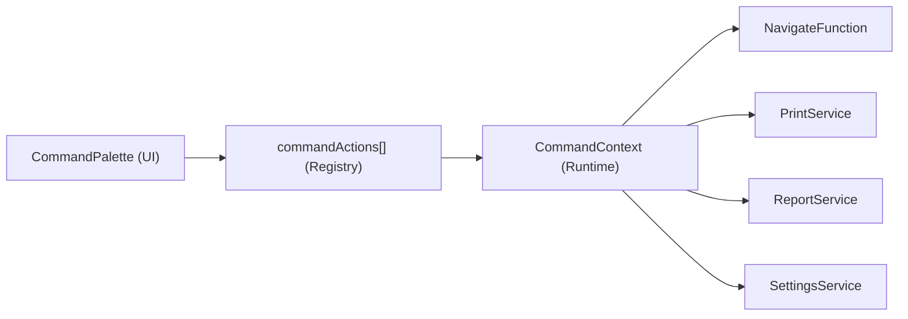
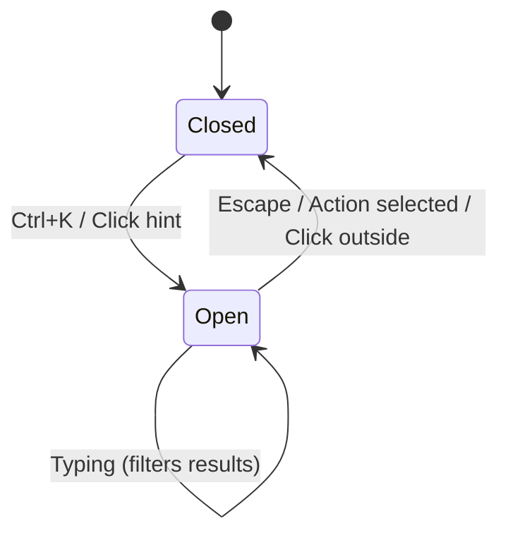

# Data Model: Command Palette

## Entities

### CommandAction
The core entity representing a single executable command in the palette.

| Field | Type | Description |
|-------|------|-------------|
| `id` | `string` | Unique identifier (e.g., `nav-pos`, `product-add`) |
| `label` | `string` | Arabic display label |
| `keywords` | `string[]` | Search terms (Arabic + English) |
| `icon` | `React.ReactNode` | Lucide icon element |
| `group` | `CommandGroup` | Category grouping |
| `action` | `(ctx: CommandContext) => void \| Promise<void>` | Execution callback |
| `shortcut?` | `string` | Optional keyboard shortcut display |

### CommandGroup
Enum-like type for action categories.

```typescript
type CommandGroup = 'navigation' | 'products' | 'categories' | 'customers' | 'pdf' | 'system';
```

### CommandContext
Runtime context passed to each action's callback.

| Field | Type | Description |
|-------|------|-------------|
| `navigate` | `NavigateFunction` | React Router navigation |
| `printService` | `PrintService` | PDF generation |
| `reportService` | `ReportService` | Report data fetching |
| `settingsService` | `SettingsService` | App settings |
| `toggleStockAlerts` | `() => void` | Stock alert panel toggle |

## Relationships



## State Transitions

The palette has only two states: **Open** and **Closed**.



## Validation Rules
- `id` must be unique across all actions
- `label` must be non-empty
- `keywords` must contain at least 1 element
- `action` must be a callable function
